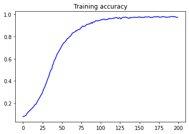
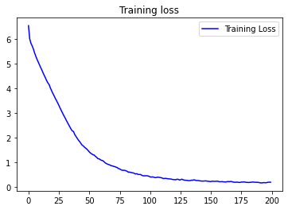

# Story_Generator

#### This is a story generator model which is using bidirectional LSTM for model building and NLP for data preprocessing.  The model is trained on different short stories which are collected and stored in stories.txt. For prediction an input is given and it can predict upto any number of words as per user. 

#### The training results can be seen here:

#### The model was deployed using Amazon web services E2C Instance. The files regarding the deployment can be found in the folder [here]()

#### See the working of the app below:
<figure class="video_container">
  <video controls="true" allowfullscreen="true">
    <source src="assests/story_gen.webm" type="video/webm">
  </video>
</figure>
